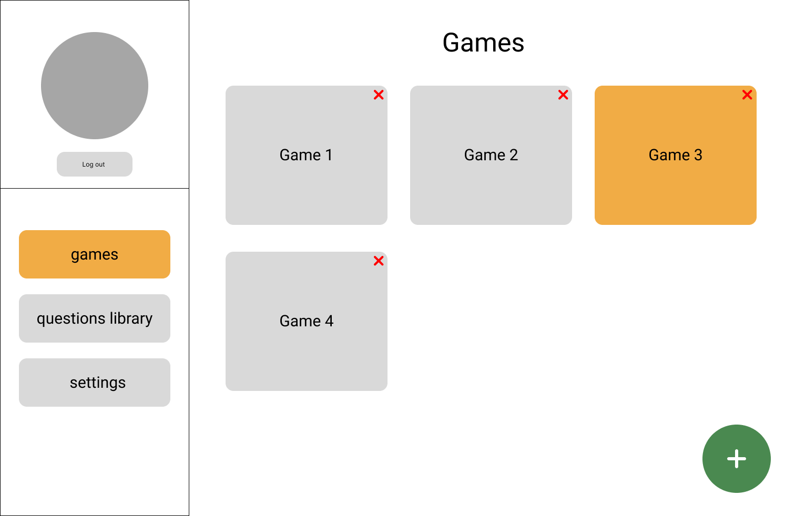
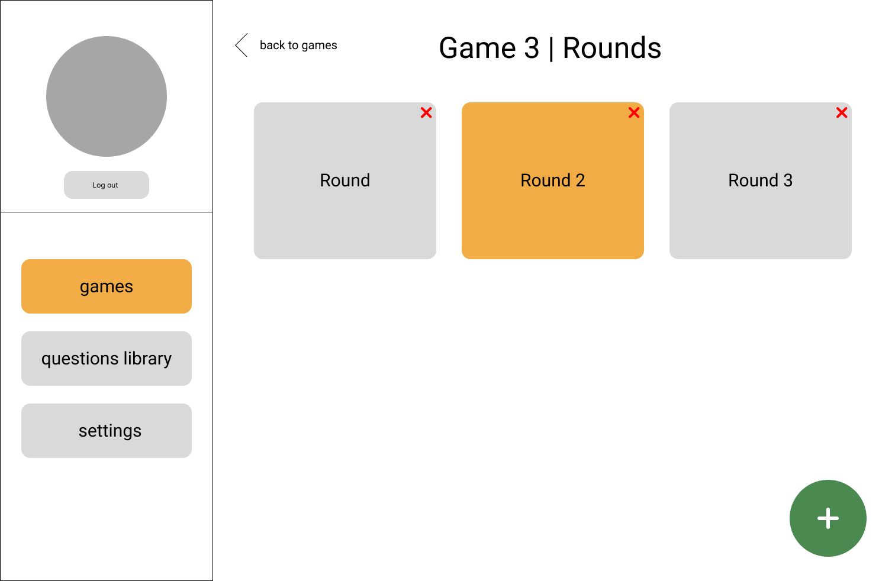
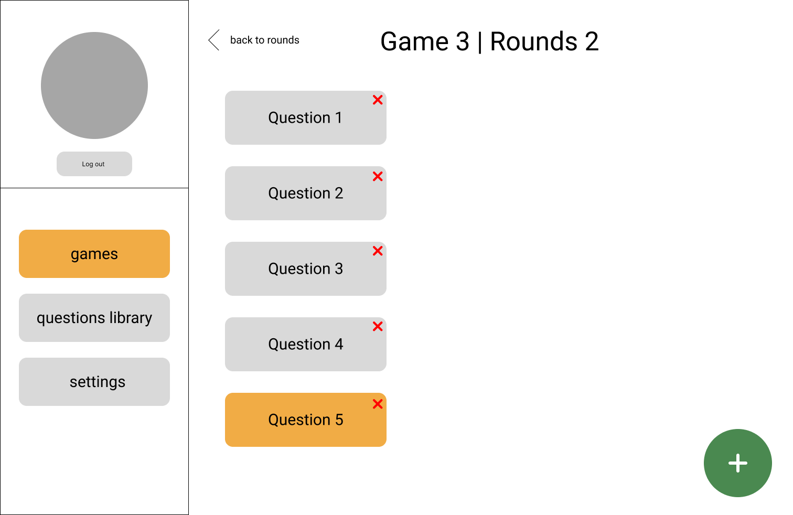
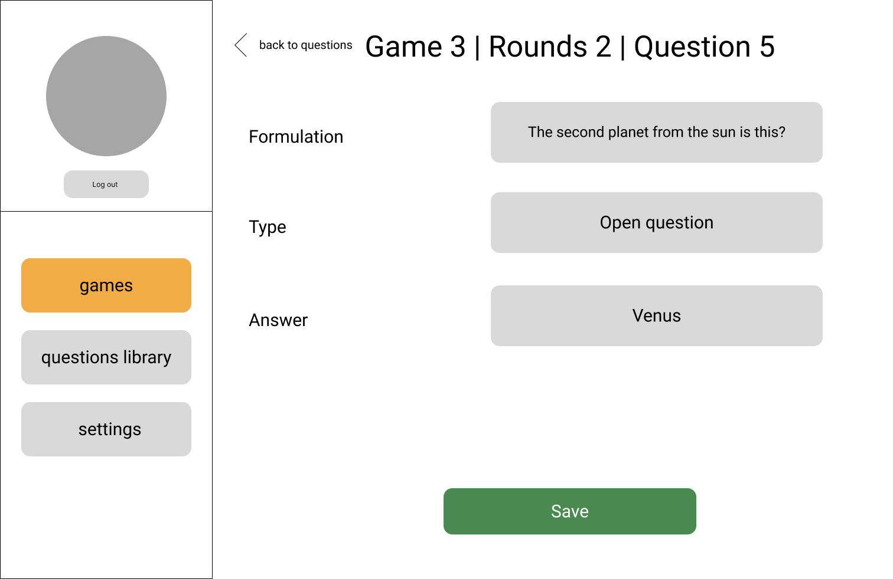

# QuizEngine

QuizEngine - движок для создания и проведения квизов.

## Визуальная схема фронтенда

### Панель ведущего

[//]: # (### Приложение участника)

## Документация

1. Маркетинг
   * [Стейкхолдеры](./docs/01-marketing/01-stakeholders.md)
   * [Целевая аудитория](./docs/01-marketing/02-target-audience.md)
   * [Конкурентный анализ](./docs/01-marketing/03-competitors.md)
   * [Анализ экономики](./docs/01-marketing/04-economy.md)
   * [Пользовательские истории](./docs/01-marketing/05-user-stories.md)
2. DevOps
3. Тесты
4. Архитектура
   1. [Компонентная схема](./docs/04-architecture/architecture.md)
   2. [Интеграционная схема](./docs/04-architecture/integration.md)
   3. [Описание API](./docs/04-architecture/api.md)